<h1 align="center">🧠 Halil / SynChap</h1>
<h3 align="center">Garson by day • Developer by night</h3>

<p align="center">
  
</p>

---

## 🧩 Hızlı Özet

<ul>
  <li>🍽 Gündüz: restaurant server</li>
  <li>💻 Gece: full‑stack web + AI denemeleri</li>
  <li>🎨 Logo, tasarım ve canlı yayın meraklısı</li>
  <li>🧪 AI agent, context ve otomasyon deneycisi</li>
</ul>

---

## 🛠 Kullandığım Teknolojiler

<div align="center">

<table>
  <tr>
    <th>Alan</th>
    <th>Tech</th>
  </tr>
  <tr>
    <td>Frontend</td>
    <td>HTML, CSS, JavaScript, TypeScript, React/Next</td>
  </tr>
  <tr>
    <td>Backend</td>
    <td>Node.js, Express, Python</td>
  </tr>
  <tr>
    <td>Veritabanı</td>
    <td>PostgreSQL, MongoDB, SQLite</td>
  </tr>
  <tr>
    <td>DevOps & Diğer</td>
    <td>Git, GitHub Actions, Docker denemeleri, local LLM / WebUI</td>
  </tr>
</table>

</div>

---

## 🧠 Basit bir “SynChap” akış diyagramı (Mermaid)

```mermaid
flowchart TD
    A[Hafta içi iş] --> B[Boş zaman]
    B --> C[Vibe coding]
    C --> D{Projeler}
    D -->|Web| E[HTML + CSS + JS]
    D -->|Full‑stack| F[TypeScript + Node.js]
    D -->|AI| G[Agent + LLM entegrasyonları]
    G --> H[Otomasyon ve denemeler]
```



---

## 📈 GitHub aktiviteleri

<div align="center">


<br/>


<br/>


</div>

---

## 🔗 Linkler

- 🐙 GitHub: <a href="https://github.com/halil2002sak">github.com/halil2002sak</a>  
- 💼 LinkedIn: <a href="https://www.linkedin.com/in/halil2002sak">linkedin.com/in/halil2002sak</a>  
- 🎥 SynChap olarak online içerikler  

---

<details>
  <summary>💡 Küçük “dev notu” (JS vibes)</summary>

```js
const weekend = ["Cumartesi", "Pazar"];
const mood = "vibe coding";

weekend.forEach(day => {
  console.log(`${day}: ${mood} time 🚀`);
});
```

</details>